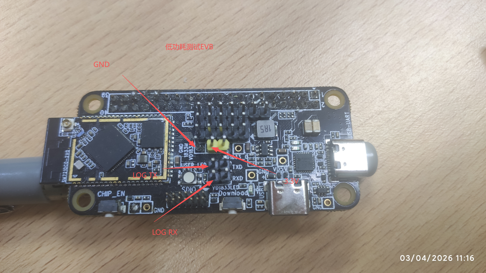
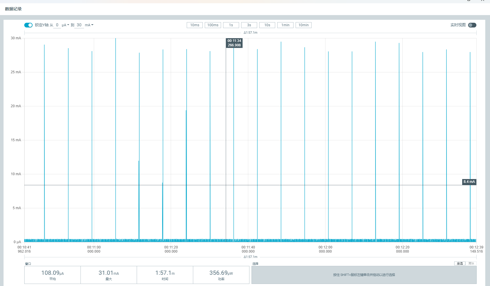

# Ameba RTL8721Dx WiFi Low Power (LPS) Current Measurement Example (FreeRTOS)

* [中文版本](./README_CN.md)

This example is based on the RTL8721Dx series SoC and is used to **measure system current consumption in WiFi Low Power Save (LPS) mode**.  
It demonstrates the typical power consumption and test procedure when the device is connected to a WiFi AP and then enters LPS mode.

- 📎 EVB Purchase Links  [🛒 Taobao](https://item.taobao.com/item.htm?id=904981157046) | [📦 Amazon](https://www.amazon.com/-/zh/dp/B0FB33DT2C/)
- 📄 [Chip Information](https://aiot.realmcu.com/cn/module/index.html)
- 📚 [WiFi Power Save Documentation](https://aiot.realmcu.com/cn/latest/rtos/ps/powertest/index.html#wi-fi)

---

## ✨ Features

- After connecting to a WiFi AP, the module enters WiFi LPS low power save mode, with DTIM set to 10 in this example  
- Use AT commands together with an ammeter to observe current changes and power consumption in LPS mode  

---

## Working Principle

1. The module powers up and runs this demo, providing AT command interface on the UART.  
2. The user connects the module to the target WiFi AP via AT commands and waits until the connection becomes stable.  
3. Use `AT+WLSTATE` and `AT+WLRSSI` to check link status, RSSI and channel information.  
4. Configure LPS DTIM interval using `AT+WLDBG=lps_dtim_set n`. In this demo we recommend `n = 10` (about one Beacon receive per second).  
5. Enter power save mode using `AT+TICKPS=R` to enable power save operation（WiFi in LPS mode）.  
6. Power the module from a dedicated supply path and observe the current with an ammeter to evaluate WiFi-connected LPS power consumption.

> It is recommended to perform the measurement in a **shielded** or low-interference RF environment.  
> External interference may cause frequent re-association, channel changes or retransmissions, which will increase power consumption and affect test accuracy.

---

### 🔌 Hardware Connection

- Use the official EVB (evaluation board).  
- Power the **module directly from the module side** so that the measured current reflects the module itself.  
- Refer to the following figure for wiring details:  



---

## 🚀 Quick Start

1️⃣ **Set Up SDK Environment**

- Configure `env.sh` (or `env.bat`) path:

  ```bash
  source {sdk}/env.sh
  ```

- Replace `{sdk}` with the absolute path to `env.sh` in the root directory of the [ameba-rtos SDK](https://github.com/Ameba-AIoT/ameba-rtos).  
- If the SDK path does not change, this step needs to be done only once.  

⚡ **Note**: This example supports SDK version **≥ v1.2**.

---

2️⃣ **Build the Demo**

In the demo project root directory, run:

```bash
source env.sh
ameba.py build
```

---

3️⃣ **Flash to Device**

Using bin files generated in the current project directory:

```bash
ameba.py flash --p COMx --image km4_boot_all.bin 0x08000000 0x8014000 --image km0_km4_app.bin 0x08014000 0x8200000
```

**Or use prebuilt bin files provided in the parent directory:**

```bash
ameba.py flash --p COMx --image ../km4_boot_all.bin 0x08000000 0x8014000 --image ../km0_km4_app.bin 0x08014000 0x8200000
```

> Replace `COMx` with your actual serial port, e.g. `COM5`.

---

4️⃣ **Open Serial Monitor**

```bash
ameba.py monitor --port COMx --b 1500000
```

---

5️⃣ **Connect to WiFi**

Use AT commands to connect to the AP. See [AT+WLCONN](https://aiot.realmcu.com/cn/latest/rtos/atcmd/at_command_wifi.html#at-wlconn) for details.

Example:

```bash
AT+WLCONN=ssid,Xiaomi_Pro_2G,pw,12345678
```

---

6️⃣ **Check Link Status and RSSI**

- Use `AT+WLSTATE` to query current link information (SSID, BSSID, channel, etc.)  
- Use `AT+WLRSSI` to check current RSSI  

```bash
AT+WLSTATE
AT+WLRSSI
```

References:  
- [AT+WLRSSI](https://aiot.realmcu.com/cn/latest/rtos/atcmd/at_command_wifi.html#at-wlrssi)  
- [AT+WLSTATE](https://aiot.realmcu.com/cn/latest/rtos/atcmd/at_command_wifi.html#at-wlstate)

> **Note**: RSSI, channel, and RF environment will significantly affect LPS power consumption.  
> It is recommended to test in a shielded box or a clean RF environment to avoid extra power caused by reconnection/retransmission.

---

7️⃣ **Set DTIM = 10**

After the connection becomes stable (typically 10–20 seconds), configure the DTIM interval for LPS mode:

- Command format: `AT+WLDBG=lps_dtim_set n`  
- Meaning: in LPS mode, wake up every `n` Beacon intervals;  
- Example: `n = 10` means waking up to receive Beacon about once per second (depending on AP Beacon interval).

Example:

```bash
AT+WLDBG=lps_dtim_set 10
```

---

8️⃣ **Enter Low Power powersave Mode**

Enter power save mode with:

```bash
AT+TICKPS=R
```
Reference:  
- [AT+TICKPS](https://aiot.realmcu.com/cn/latest/rtos/atcmd/at_command_common.html#at-tickps)

---
Now you can measure the average current of the module in LPS mode to evaluate power consumption while maintaining WiFi connection.



---

## 📝 Log Example

```plaintext
log:
14:28:17.631  ROM:[V1.1]
14:28:17.631  FLASH RATE:1, Pinmux:0
14:28:17.631  IMG1(OTA1) VALID, ret: 0
14:28:17.631  IMG1 ENTRY[f800779:0]
14:28:17.631  [BOOT-I] KM4 BOOT REASON 0: Initial Power on
14:28:17.632  [BOOT-I] KM4 CPU CLK: 240000000 Hz
14:28:17.632  [BOOT-I] KM0 CPU CLK: 96000000 Hz
14:28:17.632  [BOOT-I] PSRAM Ctrl CLK: 240000000 Hz 
14:28:17.632  [BOOT-I] IMG1 ENTER MSP:[30009FDC]
14:28:17.632  [BOOT-I] Build Time: Mar  3 2026 16:51:41
14:28:17.632  [BOOT-I] IMG1 SECURE STATE: 1
14:28:17.632  [FLASH-I] FLASH CLK: 80000000 Hz
14:28:17.632  [FLASH-I] Flash ID: c8-40-17 (Capacity: 64M-bit)
14:28:17.632  [FLASH-I] Flash Read 4IO
14:28:17.632  [FLASH-I] FLASH HandShake[0x2 OK]
14:28:17.632  [BOOT-I] Init APM PSRAM
14:28:17.632  [PSRAM-I] Cal win size 31
14:28:17.632  [BOOT-I] KM0 XIP IMG[0c000000:53c00]
14:28:17.632  [BOOT-I] KM0 SRAM[20068000:30e0]
14:28:17.632  [BOOT-I] KM0 PSRAM[0c056ce0:20]
14:28:17.632  [BOOT-I] KM0 ENTRY[20004d00:60]
14:28:17.632  [BOOT-I] KM4 XIP IMG[0e000000:66f20]
14:28:17.632  [BOOT-I] KM4 SRAM[2000b000:1ee0]
14:28:17.632  [BOOT-I] KM4 PSRAM[0e068e00:20]
14:28:17.632  [BOOT-I] KM4 ENTRY[20004d80:40]
14:28:17.632  [BOOT-I] IMG2 BOOT from OTA 1, Version: 1.1 
14:28:17.632  [BOOT-I] Image2Entry @ 0xe00d43d ...
14:28:17.632  [APP-I] KM4 APP START 
14:28:17.632  [APP-I] VTOR: 30007[000LOC, VTOR_NKS-I] KMS:3000700 init_retarget_00
14:28:17.632  locks
14:28:17.632  [APP-I] VTOR: 30007000, VTOR_NS:30007000
14:28:17.632  [APP-I] IMG2 SECURE STATE: 1
14:28:17.632  [MAIN-I] IWDG refresh on[!C
14:28:17.632  LK-I] [CAL4M]: delta:[M0A tINar-gIet]: 3K2M00 P POMS:  0S PTARTPM_Limit:30000 
14:28:17.632   
14:28:17.632  [CLK-I] [CAL131K]: delta:27 target:2441 PPM: 11061 PPM_Limit:30000 
14:28:17.632  [LOCKS-I] KM4 init_retarget_locks
14:28:17.632  [APP-I] BOR arises when supply voltage decreases under 2.57V and recovers above 2.7V.
14:28:17.632  [MAIN-I] KM4 MAIN 
14:28:17.632  [VER-I] AMEBA-RTOS SDK VERSION: 1.2.0
14:28:17.633  [MAIN-I] File System Init Success 
14:28:17.633  [MAIN-I] KM4 START SCHEDULER 
14:28:17.633  interface 0 is initialized
14:28:17.633  interface 1 is initialized
14:28:17.633  [WLAN-I] LWIP consume heap 1312
14:28:17.633  [WLAN-A] Init WIFI
14:28:17.633  [WLAN-A] Band=2.4G&5G
14:28:17.670  [WLAN-I] NP consume heap 20400
14:28:17.670  [WLAN-A] set ssid Xiaomi_Pro_2G_5G
14:28:17.814  [WLAN-A] start auth to 50:64:2b:34:88:9f
14:28:17.846  [WLAN-A] auth success, start assoc
14:28:17.879  [WLAN-A] assoc success(7)
14:28:18.000  [WLAN-A] set pairwise key 4(WEP40-1 WEP104-5 TKIP-2 AES-4 GCMP-15)
14:28:18.000  [WLAN-A] set group key 4 1
14:28:18.000  [WLAN-I] set cam: gtk alg 4 0
14:28:18.001  [$]wifi connected
14:28:19.136  [$]wifi got ip:"192.168.32.25"
14:28:19.136  wtn dhcp success
14:28:19.136  [WLAN-I] AP consume heap 12000
14:28:19.136  [WLAN-I] Available heap after wifi init 4527392
14:28:33.855  AT+WLDBG=lps_dtim_set 10
14:28:33.855  [WLDBG]: _AT_WLAN_IWPRIV_
14:28:33.855  [WLAN-A] [iwpriv_command] cmd name: lps_dtim_set
14:28:33.855  [WLAN-A] lps_dtim=10
14:28:33.855  
14:28:33.855  OK
14:28:33.855  
14:28:33.855  [MEM] After do cmd, available heap 4528000
14:28:33.855  
14:28:33.855  
14:28:33.855  #
14:28:42.288  AT+TICKPS=R
14:28:42.288  
14:28:42.288  [MEM] After do cmd, available heap 4528000
14:28:42.288  
14:28:42.288  
14:28:42.288  #
14:28:42.288  APPG
14:28:42.288  NPPG
14:28:43.136  NPPW
14:28:43.152  NPPG
14:28:43.248  NPPW
14:28:43.248  NPPG
14:28:43.344  NPPW
14:28:43.344  NPPG
14:28:43.440  NPPW
14:28:43.440  NPPG
14:28:43.552  NPPW
14:28:43.552  NPPG
14:28:43.648  NPPW
14:28:43.648  NPPG
14:28:43.759  NPPW
14:28:43.759  NPPG
14:28:43.856  NPPW
14:28:43.856  NPPG
14:28:43.952  NPPW
14:28:43.952  NPPG
14:28:44.064  NPPW
14:28:44.064  NPPG
14:28:44.159  NPPW
14:28:44.159  NPPG
14:28:44.272  NPPW
14:28:44.272  NPPG
14:28:44.368  NPPW
14:28:44.368  NPPG
14:28:44.464  NPPW
14:28:44.464  NPPG
14:28:44.576  NPPW
14:28:44.576  NPPG
14:28:44.672  NPPW
14:28:44.672  NPPG
14:28:44.784  NPPW
14:28:44.784  NPPG
14:28:44.880  NPPW
14:28:44.880  NPPG
14:28:44.975  NPPW
14:28:44.991  NPPG
14:28:45.088  NPPW
14:28:45.088  NPPG
14:28:45.183  NPPW
14:28:45.183  NPPG
14:28:45.296  NPPW
14:28:45.296  NPPG
14:28:45.392  NPPW
14:28:45.392  NPPG
14:28:45.488  NPPW
14:28:45.503  NPPG
14:28:45.599  NPPW
14:28:45.599  NPPG
14:28:45.696  NPPW
14:28:45.696  NPPG
14:28:45.807  NPPW
14:28:45.807  NPPG
14:28:45.903  NPPW
14:28:45.903  NPPG
14:28:45.999  NPPW
14:28:46.015  NPPG
14:28:46.111  NPPW
14:28:46.111  NPPG
14:28:46.207  NPPW
14:28:46.207  NPPG
14:28:46.320  NPPW
14:28:46.320  NPPG
14:28:46.415  NPPW
14:28:46.415  NPPG
14:28:46.511  NPPW
14:28:46.527  NPPG
14:28:46.623  NPPW
14:28:46.623  NPPG
14:28:46.719  NPPW
14:28:46.719  NPPG
14:28:46.831  NPPW
14:28:46.831  NPPG
14:28:46.927  NPPW
14:28:46.927  NPPG
14:28:47.022  NPPW
14:28:47.039  NPPG
14:28:47.136  NPPW
14:28:47.136  NPPG
14:28:47.231  NPPW
14:28:47.231  NPPG
14:28:47.343  NPPW
14:28:47.343  NPPG
14:28:47.439  NPPW
14:28:47.439  NPPG
14:28:47.535  NPPW
14:28:47.554  APPW
14:28:47.554  [PMC-I] SOCPS_KM0WKM4_ipc_int 
14:28:47.554  [PMC-I] FW wakeup KM4 via IPC 
14:28:47.554  APPG
14:28:47.554  APPW
14:28:47.554  APPG
14:28:47.570  NPPG
14:28:47.650  NPPW
14:28:47.650  NPPG

```


